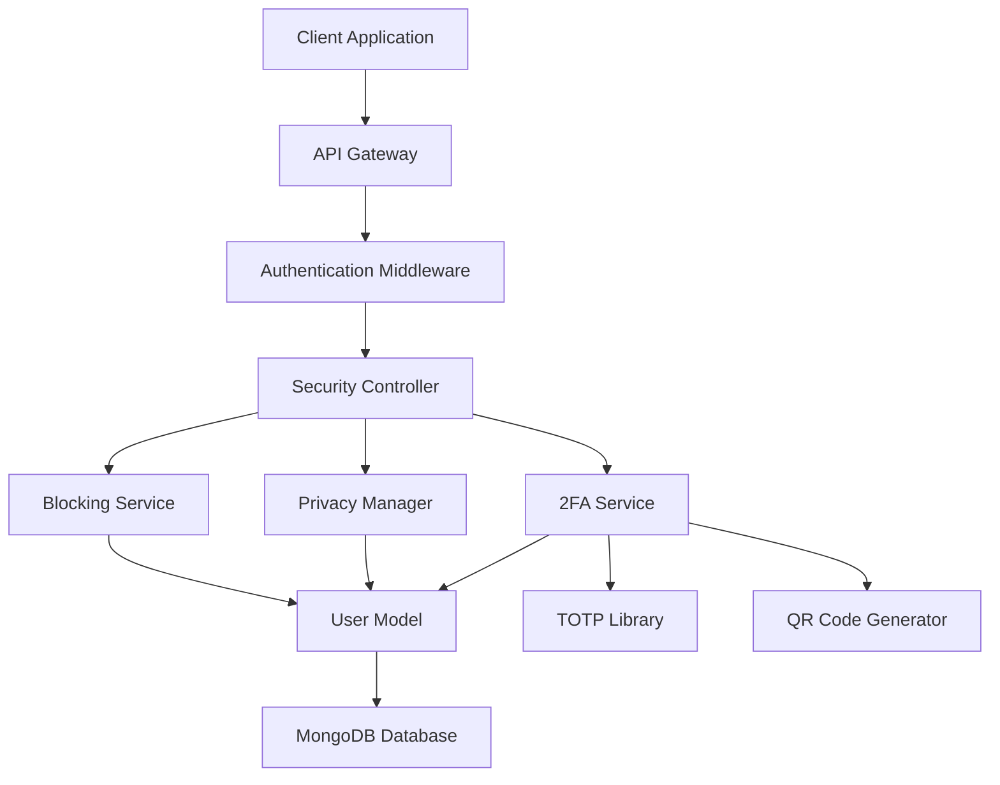

# Design Document

## Overview

This document outlines the technical design for implementing comprehensive user security and privacy features including user blocking functionality, private account settings, and two-factor authentication using authenticator apps. The design integrates seamlessly with the existing Aeko social platform architecture while maintaining performance and security standards.

## Architecture

### High-Level Architecture



### Service Layer Architecture

The security features will be implemented as modular services that integrate with the existing Express.js backend:

1. **Blocking Service**: Manages user blocking relationships and enforcement
2. **Privacy Manager**: Handles account privacy settings and content visibility
3. **Two-Factor Authentication Service**: Manages TOTP setup, verification, and backup codes
4. **Security Middleware**: Enforces blocking and privacy rules across all endpoints

## Components and Interfaces

### 1. User Model Extensions

The existing User model will be extended with new security-related fields:

```javascript
// Additional fields for User schema
{
  // Blocking system
  blockedUsers: [{
    user: { type: mongoose.Schema.Types.ObjectId, ref: "User" },
    blockedAt: { type: Date, default: Date.now },
    reason: { type: String, default: "" }
  }],
  
  // Privacy settings
  privacy: {
    isPrivate: { type: Boolean, default: false },
    allowFollowRequests: { type: Boolean, default: true },
    showOnlineStatus: { type: Boolean, default: true },
    allowDirectMessages: { 
      type: String, 
      enum: ["everyone", "followers", "none"], 
      default: "everyone" 
    }
  },
  
  // Follow requests for private accounts
  followRequests: [{
    user: { type: mongoose.Schema.Types.ObjectId, ref: "User" },
    requestedAt: { type: Date, default: Date.now },
    status: { 
      type: String, 
      enum: ["pending", "approved", "rejected"], 
      default: "pending" 
    }
  }],
  
  // Two-Factor Authentication
  twoFactorAuth: {
    isEnabled: { type: Boolean, default: false },
    secret: { type: String, default: null },
    backupCodes: [{ 
      code: String, 
      used: { type: Boolean, default: false },
      usedAt: Date 
    }],
    enabledAt: { type: Date, default: null },
    lastUsed: { type: Date, default: null }
  }
}
```

### 2. Security Controller

```javascript
// routes/security.js
class SecurityController {
  // Blocking functionality
  async blockUser(req, res)
  async unblockUser(req, res)
  async getBlockedUsers(req, res)
  async checkBlockStatus(req, res)
  
  // Privacy settings
  async updatePrivacySettings(req, res)
  async getPrivacySettings(req, res)
  async sendFollowRequest(req, res)
  async handleFollowRequest(req, res)
  async getFollowRequests(req, res)
  
  // 2FA functionality
  async setup2FA(req, res)
  async verify2FASetup(req, res)
  async disable2FA(req, res)
  async verify2FALogin(req, res)
  async generateBackupCodes(req, res)
  async useBackupCode(req, res)
}
```

### 3. Blocking Service

```javascript
// services/blockingService.js
class BlockingService {
  async blockUser(blockerId, blockedId, reason = "")
  async unblockUser(blockerId, blockedId)
  async isBlocked(userId1, userId2)
  async getBlockedUsers(userId, page = 1, limit = 20)
  async enforceBlockingRules(currentUserId, targetUserId)
}
```

### 4. Privacy Manager

```javascript
// services/privacyManager.js
class PrivacyManager {
  async updatePrivacySettings(userId, settings)
  async canViewProfile(viewerId, profileId)
  async canViewPosts(viewerId, authorId)
  async canSendMessage(senderId, recipientId)
  async sendFollowRequest(requesterId, targetId)
  async handleFollowRequest(targetId, requesterId, action)
  async getFollowRequests(userId, status = "pending")
}
```

### 5. Two-Factor Authentication Service

```javascript
// services/twoFactorService.js
class TwoFactorService {
  async generateSecret(userId)
  async generateQRCode(userId, secret)
  async verifyTOTP(userId, token)
  async enableTwoFactor(userId, verificationToken)
  async disableTwoFactor(userId, password, totpToken)
  async generateBackupCodes(userId)
  async verifyBackupCode(userId, code)
  async validateLoginWith2FA(userId, totpToken)
}
```

### 6. Security Middleware

```javascript
// middleware/securityMiddleware.js
const blockingMiddleware = async (req, res, next)
const privacyMiddleware = async (req, res, next)
const twoFactorMiddleware = async (req, res, next)
```

## Data Models

### 1. Extended User Model Fields

```javascript
// Blocking relationships
blockedUsers: [{
  user: ObjectId,           // Reference to blocked user
  blockedAt: Date,          // When the block occurred
  reason: String            // Optional reason for blocking
}]

// Privacy settings
privacy: {
  isPrivate: Boolean,       // Account privacy status
  allowFollowRequests: Boolean,
  showOnlineStatus: Boolean,
  allowDirectMessages: String // "everyone", "followers", "none"
}

// Follow requests (for private accounts)
followRequests: [{
  user: ObjectId,           // User requesting to follow
  requestedAt: Date,        // When request was made
  status: String            // "pending", "approved", "rejected"
}]

// Two-Factor Authentication
twoFactorAuth: {
  isEnabled: Boolean,       // 2FA status
  secret: String,           // TOTP secret (encrypted)
  backupCodes: [{
    code: String,           // Backup code (hashed)
    used: Boolean,          // Whether code has been used
    usedAt: Date           // When code was used
  }],
  enabledAt: Date,         // When 2FA was enabled
  lastUsed: Date           // Last successful 2FA verification
}
```

### 2. Security Event Log Model

```javascript
// models/SecurityEvent.js
const SecurityEventSchema = new mongoose.Schema({
  user: { type: mongoose.Schema.Types.ObjectId, ref: "User", required: true },
  eventType: { 
    type: String, 
    enum: ["block", "unblock", "privacy_change", "2fa_enabled", "2fa_disabled", "2fa_used", "backup_code_used"],
    required: true 
  },
  targetUser: { type: mongoose.Schema.Types.ObjectId, ref: "User" },
  metadata: { type: mongoose.Schema.Types.Mixed },
  ipAddress: String,
  userAgent: String,
  timestamp: { type: Date, default: Date.now }
});
```

## Error Handling

### 1. Blocking Errors

```javascript
class BlockingError extends Error {
  constructor(message, code) {
    super(message);
    this.name = 'BlockingError';
    this.code = code;
  }
}

// Error codes:
// ALREADY_BLOCKED, NOT_BLOCKED, CANNOT_BLOCK_SELF, USER_NOT_FOUND
```

### 2. Privacy Errors

```javascript
class PrivacyError extends Error {
  constructor(message, code) {
    super(message);
    this.name = 'PrivacyError';
    this.code = code;
  }
}

// Error codes:
// PRIVATE_ACCOUNT, FOLLOW_REQUEST_PENDING, FOLLOW_REQUEST_REJECTED, INVALID_PRIVACY_SETTING
```

### 3. 2FA Errors

```javascript
class TwoFactorError extends Error {
  constructor(message, code) {
    super(message);
    this.name = 'TwoFactorError';
    this.code = code;
  }
}

// Error codes:
// INVALID_TOTP, 2FA_NOT_ENABLED, 2FA_ALREADY_ENABLED, INVALID_BACKUP_CODE, BACKUP_CODE_USED
```

## Testing Strategy

### 1. Unit Tests

- **Blocking Service Tests**
  - Test blocking/unblocking functionality
  - Test blocked user retrieval with pagination
  - Test blocking rule enforcement

- **Privacy Manager Tests**
  - Test privacy setting updates
  - Test content visibility rules
  - Test follow request handling

- **2FA Service Tests**
  - Test TOTP generation and verification
  - Test backup code generation and usage
  - Test QR code generation

### 2. Integration Tests

- **API Endpoint Tests**
  - Test all security endpoints with various scenarios
  - Test middleware integration
  - Test error handling and edge cases

- **Database Integration Tests**
  - Test data persistence and retrieval
  - Test concurrent operations
  - Test data consistency

### 3. Security Tests

- **Authentication Tests**
  - Test 2FA bypass attempts
  - Test backup code brute force protection
  - Test session management with 2FA

- **Authorization Tests**
  - Test blocking enforcement across all endpoints
  - Test privacy rule enforcement
  - Test privilege escalation attempts

### 4. Performance Tests

- **Load Testing**
  - Test blocking checks under high load
  - Test privacy filtering performance
  - Test 2FA verification performance

- **Database Performance**
  - Test query optimization for blocking checks
  - Test indexing strategy effectiveness
  - Test pagination performance

## Security Considerations

### 1. Data Protection

- **Encryption**: 2FA secrets stored encrypted using AES-256
- **Hashing**: Backup codes stored as bcrypt hashes
- **Rate Limiting**: 2FA verification attempts limited to prevent brute force
- **Audit Logging**: All security events logged for monitoring

### 2. Privacy Protection

- **Data Minimization**: Only necessary data exposed based on privacy settings
- **Access Control**: Strict enforcement of blocking and privacy rules
- **Consent Management**: Clear user consent for privacy setting changes

### 3. Authentication Security

- **TOTP Standards**: RFC 6238 compliant TOTP implementation
- **Backup Security**: Secure backup code generation and storage
- **Session Management**: Enhanced session security with 2FA
- **Recovery Process**: Secure account recovery procedures

## Dependencies

### New Dependencies Required

```json
{
  "speakeasy": "^2.0.0",        // TOTP generation and verification
  "qrcode": "^1.5.3",           // QR code generation
  "crypto": "built-in"          // Encryption for 2FA secrets
}
```

### Existing Dependencies Used

- `bcrypt`: For hashing backup codes
- `jsonwebtoken`: For secure token generation
- `mongoose`: For database operations
- `express-rate-limit`: For rate limiting 2FA attempts

## API Endpoints

### Blocking Endpoints

```
POST   /api/security/block/:userId        - Block a user
DELETE /api/security/block/:userId        - Unblock a user
GET    /api/security/blocked              - Get blocked users list
GET    /api/security/block-status/:userId - Check if user is blocked
```

### Privacy Endpoints

```
PUT    /api/security/privacy              - Update privacy settings
GET    /api/security/privacy              - Get privacy settings
POST   /api/security/follow-request/:userId - Send follow request
PUT    /api/security/follow-request/:requestId - Handle follow request
GET    /api/security/follow-requests       - Get pending follow requests
```

### 2FA Endpoints

```
POST   /api/security/2fa/setup            - Initialize 2FA setup
POST   /api/security/2fa/verify-setup     - Complete 2FA setup
POST   /api/security/2fa/verify           - Verify 2FA during login
DELETE /api/security/2fa                  - Disable 2FA
POST   /api/security/2fa/backup-codes     - Generate new backup codes
POST   /api/security/2fa/backup-verify    - Verify backup code
```

## Implementation Phases

### Phase 1: User Blocking System
- Extend User model with blocking fields
- Implement BlockingService
- Create blocking API endpoints
- Add blocking middleware to existing endpoints

### Phase 2: Privacy Settings
- Add privacy fields to User model
- Implement PrivacyManager
- Create privacy and follow request endpoints
- Update content visibility logic

### Phase 3: Two-Factor Authentication
- Add 2FA fields to User model
- Implement TwoFactorService
- Create 2FA setup and verification endpoints
- Integrate 2FA into login flow

### Phase 4: Security Enhancements
- Add comprehensive audit logging
- Implement rate limiting
- Add security event monitoring
- Performance optimization